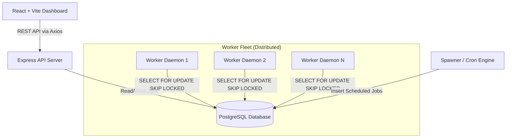
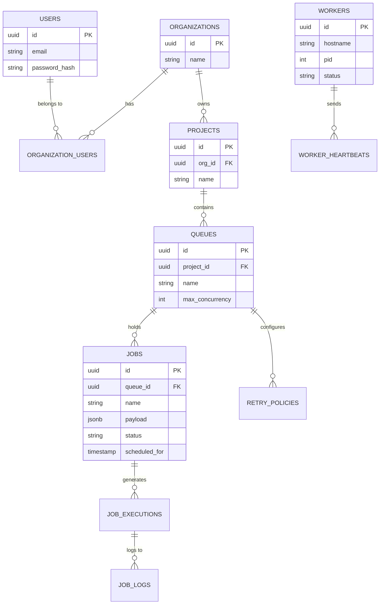

# Distributed Job Scheduler - Deliverables

**GitHub Repository:** [https://github.com/Praneeth2607/Distributed-Job-Scheduler](https://github.com/Praneeth2607/Distributed-Job-Scheduler)

---

## 1. Source Code & Setup Instructions
The complete source code, prerequisite requirements, and detailed setup instructions for both the frontend and backend are located in the repository's `README.md` file. 

## 2. Architecture Diagram

## 3. Entity-Relationship (ER) Diagram

## 4. API Documentation

| Method | Endpoint | Description | Auth Required |
|--------|----------|-------------|---------------|
| POST | `/api/v1/auth/login` | Authenticate and receive HttpOnly JWT cookie | No |
| POST | `/api/v1/auth/logout` | Clear the JWT session cookie | Yes |
| GET | `/api/v1/organizations` | Fetch all organizations for the logged-in user | Yes |
| GET | `/api/v1/organizations/:id/projects` | Fetch all projects within an organization | Yes |
| GET | `/api/v1/organizations/:id/projects/:id/queues` | Fetch all queues for a specific project | Yes |
| POST | `/api/v1/organizations/:id/projects/:id/queues` | Create a new queue in a project | Yes |
| DELETE | `/api/v1/organizations/:id/projects/:id/queues/:id`| Delete a queue and all its associated jobs | Yes |
| POST | `.../queues/:queueId/pause` | Pause a queue | Yes |
| POST | `.../queues/:queueId/resume` | Resume a queue | Yes |
| GET | `.../queues/:queueId/stats` | Fetch queue job statistics | Yes |
| GET | `.../queues/:queueId/dlq` | Fetch Dead Letter Queue jobs | Yes |
| PUT | `.../queues/:queueId/retry-policy` | Update a queue's retry policy | Yes |
| GET | `.../queues/:queueId/jobs` | Get paginated jobs for a specific queue | Yes |
| POST | `.../queues/:queueId/jobs` | Submit a new job to a queue | Yes |
| POST | `.../queues/:queueId/jobs/batch` | Submit a batch of jobs | Yes |
| DELETE | `.../queues/:queueId/jobs/:jobId` | Delete a specific job | Yes |
| POST | `.../queues/:queueId/jobs/:jobId/retry` | Manually retry a failed job | Yes |
| DELETE | `.../queues/:queueId/jobs` | Clear/Purge all jobs in a specific queue | Yes |
| POST | `.../queues/:queueId/scheduled-jobs` | Schedule a cron job | Yes |
| GET | `/api/v1/workers` | Fetch the health telemetry of all active worker daemons | Yes |
| POST | `/api/v1/workers/:workerId/heartbeat` | Send a worker heartbeat telemetry | No |

## 5. Design Decisions & Major Trade-offs

1. **PostgreSQL as a Message Queue vs. Redis/RabbitMQ**
   * **Decision:** We used PostgreSQL heavily utilizing `SELECT ... FOR UPDATE SKIP LOCKED` for the job queue rather than introducing Redis or RabbitMQ.
   * **Trade-off:** Redis provides higher throughput for extreme scale. However, PostgreSQL simplifies the infrastructure, provides transactional consistency (preventing dual-write problems), and handles tens of thousands of jobs per second comfortably, heavily reducing maintenance overhead and eliminating the need for a secondary database system.

2. **HttpOnly Cookie Authentication vs. LocalStorage JWT**
   * **Decision:** JWTs are stored in `HttpOnly` cookies rather than passing them back in the JSON body.
   * **Trade-off:** This requires CORS to be carefully configured to allow credentials, but it completely eliminates the risk of Cross-Site Scripting (XSS) attacks stealing the user's session token, providing enterprise-grade security.

3. **React Query Polling vs. WebSockets**
   * **Decision:** The frontend uses React Query to poll the API every 3 seconds for job updates and worker telemetry.
   * **Trade-off:** WebSockets offer true real-time, low-latency updates but require persistent stateful connections which complicate load balancing and scaling the Express server. Short-polling via React Query is highly resilient, stateless, and perfectly adequate for background job monitoring dashboards.

4. **Multi-Tenant Hierarchy (Org -> Project -> Queue -> Job)**
   * **Decision:** Built with a strict multi-tenant hierarchy enforced by database foreign keys and row-level access validation.
   * **Trade-off:** Adds slight complexity to the routing paths and SQL queries, but ensures the system is enterprise-ready and capable of securely hosting multiple customers/teams on a single database securely.

## 6. Automated Tests for Critical Functionality

Automated testing is implemented for the core Job Execution and Retry logic using the native `node:test` runner.
* **Test File:** `backend/src/worker/retry/backoff.test.js`
* **How to run:** Navigate to the `backend/` directory and execute `node --test src/worker/retry/backoff.test.js`.

These tests validate the critical infrastructure calculations that determine Dead Letter Queue thresholds and linear/exponential retry scheduling.
