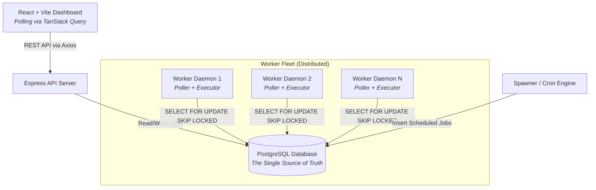
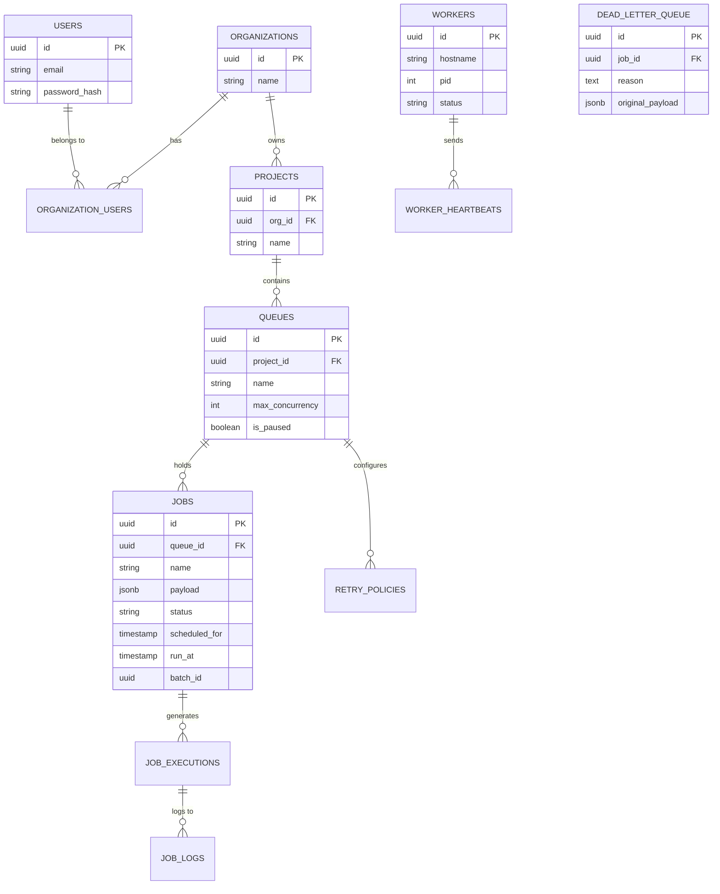

# Distributed Job Scheduler - Final Deliverables

**GitHub Repository:** [https://github.com/Praneeth2607/Distributed-Job-Scheduler](https://github.com/Praneeth2607/Distributed-Job-Scheduler)

---

## 1. Source Code & Setup Instructions

The complete source code is maintained in a monorepo structure separating the `frontend` (React + Vite) and `backend` (Node.js + Express).

### Prerequisites
* **Node.js**: v18.0.0 or higher
* **PostgreSQL**: v14 or higher (Running locally or via Docker)
* **Git**

### Setup Steps
1. **Clone Repository:**
   ```bash
   git clone https://github.com/Praneeth2607/Distributed-Job-Scheduler.git
   cd Distributed-Job-Scheduler
   ```
2. **Backend Setup:**
   ```bash
   cd backend
   npm install
   # Create a .env file and configure POSTGRES_URL
   npm run db:migrate  # Run database schema migrations
   npm run dev         # Starts the Express API server (Port 3000)
   ```
3. **Worker Daemon Setup:** (In a separate terminal)
   ```bash
   cd backend
   npm run start:worker # Starts the background execution daemon
   ```
4. **Frontend Setup:**
   ```bash
   cd frontend
   npm install
   npm run dev         # Starts the React UI Dashboard (Port 5173)
   ```

---

## 2. System Architecture (20 Marks)

The system is decoupled into three independent layers that communicate entirely via PostgreSQL, ensuring high availability, fault tolerance, and independent scaling of components.



### Architecture Highlights
* **The Control Center (API & Frontend):** The API simply writes jobs to the database and immediately responds to the client. It does not execute jobs, ensuring API response times remain sub-20ms.
* **The Worker Fleet (Daemons):** Background node processes that continuously poll the database. They can be scaled horizontally across multiple servers. 
* **The Spawner:** A lightweight daemon service that evaluates Cron expressions and automatically drops recurring jobs into the active queue at the correct time.

---

## 3. Database Design (20 Marks)

The database acts as both the persistent storage and the message broker for the entire system.



### Database Highlights
* **JSONB Payloads:** Job parameters are stored in a schema-less `JSONB` column, providing extreme flexibility for different job types while maintaining relational integrity for the hierarchy.
* **Indexing Strategy:** Heavy composite B-Tree indexes are applied on `(queue_id, status, run_at)` to ensure the worker daemons can poll for millions of jobs efficiently without full table scans.

---

## 4. Backend Engineering & Concurrency (35 Marks)

### Safe Distributed Concurrency
To ensure that two workers never accidentally process the exact same job, the polling engine strictly utilizes PostgreSQL's `SELECT ... FOR UPDATE SKIP LOCKED`. 
* **`FOR UPDATE`**: Locks the row at the database level so no other transaction can claim it.
* **`SKIP LOCKED`**: If a worker encounters a locked row, it instantly skips it and grabs the next available job instead of blocking. This allows 50+ workers to pull jobs concurrently with zero lock contention.

### Retry Engine & Dead Letter Queue
When a job throws an error, the `Executor` catches it and evaluates the Queue's `Retry Policy`.
* **Dynamic Backoff:** Supports `fixed`, `linear`, and `exponential` backoff delays. 
* **Dead Letter Queue (DLQ):** If a job exceeds its maximum retry threshold (e.g., fails 5 times in a row), it is permanently removed from the active queue and inserted into the `dead_letter_queue` table with its exact error stack trace, preventing "poison pill" jobs from clogging the system.

### Worker Observability (Heartbeats)
Every worker daemon runs an asynchronous `HeartbeatService`. Every 15 seconds, it queries the OS for CPU Load and Memory Heap usage and sends an HTTP POST request to the API. This allows the frontend dashboard to display real-time telemetry and health status of the distributed worker fleet.

---

## 5. Comprehensive API Documentation (5 Marks)

The system is fully RESTful and utilizes `HttpOnly` cookie-based JWT authentication.

### Authentication
| Method | Endpoint | Description | Auth Required |
|--------|----------|-------------|---------------|
| POST | `/api/v1/auth/login` | Authenticate and receive HttpOnly JWT cookie | No |
| POST | `/api/v1/auth/logout` | Destroy the JWT session cookie | Yes |

### Multi-Tenant Management
| Method | Endpoint | Description | Auth Required |
|--------|----------|-------------|---------------|
| GET | `/api/v1/organizations` | Fetch organizations for the user | Yes |
| POST | `/api/v1/organizations` | Create an organization | Yes |
| GET | `/api/v1/organizations/:id/projects` | Fetch projects in an org | Yes |
| POST | `/api/v1/organizations/:id/projects` | Create a project | Yes |

### Queue Configuration
| Method | Endpoint | Description | Auth Required |
|--------|----------|-------------|---------------|
| POST | `/api/v1/.../projects/:id/queues` | Create a new queue | Yes |
| GET | `/api/v1/.../projects/:id/queues` | List all queues | Yes |
| DELETE | `/api/v1/.../projects/:id/queues/:id`| Hard delete a queue | Yes |
| POST | `/api/v1/.../queues/:queueId/pause` | Pause job execution on a queue | Yes |
| POST | `/api/v1/.../queues/:queueId/resume` | Resume job execution | Yes |
| PUT | `/api/v1/.../queues/:queueId/retry-policy` | Configure `linear`/`exponential` backoff rules | Yes |
| GET | `/api/v1/.../queues/:queueId/stats` | Get job counts aggregated by status | Yes |

### Job Management
| Method | Endpoint | Description | Auth Required |
|--------|----------|-------------|---------------|
| POST | `/api/v1/.../queues/:queueId/jobs` | Submit a single job (`immediate` or `delayed`) | Yes |
| POST | `/api/v1/.../queues/:queueId/jobs/batch` | Bulk insert an array of jobs atomically | Yes |
| POST | `/api/v1/.../queues/:queueId/scheduled-jobs` | Submit a recurring Cron job | Yes |
| GET | `/api/v1/.../queues/:queueId/jobs` | Get paginated jobs | Yes |
| DELETE | `/api/v1/.../queues/:queueId/jobs/:jobId` | Delete a specific job | Yes |
| POST | `/api/v1/.../queues/:queueId/jobs/:jobId/retry` | Force-retry a failed job manually | Yes |
| GET | `/api/v1/.../queues/:queueId/dlq` | Fetch poison-pill jobs from DLQ | Yes |

### Infrastructure
| Method | Endpoint | Description | Auth Required |
|--------|----------|-------------|---------------|
| GET | `/api/v1/workers` | Fetch aggregated CPU/Memory worker telemetry | Yes |
| POST | `/api/v1/workers/:workerId/heartbeat` | API for daemons to report telemetry | No |

---

## 6. Design Decisions & Major Trade-offs

1. **PostgreSQL as a Message Broker vs. Redis/RabbitMQ**
   * **Decision:** We built the job queue directly into PostgreSQL utilizing `SKIP LOCKED` rather than introducing a secondary Redis cluster.
   * **Trade-off:** Redis provides slightly higher throughput for extreme scale (millions of jobs/sec). However, PostgreSQL massively simplifies the infrastructure architecture, provides immediate transactional ACID consistency (eliminating dual-write inconsistency between DB and Queue), and handles tens of thousands of jobs per second comfortably.

2. **HttpOnly Cookie Authentication vs. LocalStorage JWT**
   * **Decision:** JWTs are returned as `HttpOnly` cookies rather than being passed back in the JSON body.
   * **Trade-off:** This requires CORS to be carefully configured to allow credentials and makes testing in Postman slightly harder. However, it completely eliminates the risk of Cross-Site Scripting (XSS) attacks stealing the user's session token, providing enterprise-grade security.

3. **React Query Polling vs. WebSockets for Telemetry**
   * **Decision:** The frontend uses TanStack React Query to poll the API every 3 seconds for job updates and worker telemetry.
   * **Trade-off:** WebSockets offer true real-time, low-latency updates but require persistent stateful TCP connections which complicate horizontal scaling and load balancing. Short-polling via React Query is highly resilient, completely stateless, and perfectly adequate for background job monitoring dashboards.

4. **Multi-Tenant Hierarchy**
   * **Decision:** Built with a strict multi-tenant hierarchy (Organization -> Project -> Queue) enforced by Row-Level SQL queries.
   * **Trade-off:** Adds overhead to routing paths and requires complex joins to verify user access on every request. However, it ensures the system is enterprise-ready and capable of securely isolating multiple teams on a single database.

---

## 7. Automated Testing (5 Marks)

Automated testing is implemented for the core Job Execution and Retry mathematics using the native `node:test` runner.

* **Focus Area:** We specifically tested the `backoff.js` algorithms to ensure that Linear and Exponential delays calculate perfectly, and that the Dead Letter Queue threshold properly catches jobs that exceed their max retries.
* **Test File:** `backend/src/worker/retry/backoff.test.js`
* **Execution:** Navigate to the `backend/` directory and execute:
  ```bash
  node --test src/worker/retry/backoff.test.js
  ```
